# ParkRunPart1
The first part of a series of posts analysing the data from the Malahide Park Run.


```python
import pandas as pd
import matplotlib.pyplot as plt
import seaborn as sns
import numpy as np
import scipy.stats as stats
%matplotlib inline
from statsmodels.tsa.seasonal import seasonal_decompose
```

    C:\ProgramData\Anaconda2\lib\site-packages\statsmodels\compat\pandas.py:56: FutureWarning: The pandas.core.datetools module is deprecated and will be removed in a future version. Please use the pandas.tseries module instead.
      from pandas.core import datetools
    

### Import the data file.<br>Some cleaning has already been done in Notepad and Excel.<br>Excel did not want to play nice with unicode datetime. CHrist!


```python
path_to_file = 'C:\Users\Administrator\Documents\Python Scripts\examplepark.csv'
data = pd.read_csv(path_to_file)
```


```python
data['Time'] = ((pd.to_numeric(data['Time'].str.slice(0,2)))*60)+(pd.to_numeric(data['Time'].str.slice(3,5)))+((pd.to_numeric(data['Time'].str.slice(6,8)))/60)
data['Date'] = pd.to_datetime(data['Date'],errors='coerce', format='%d-%m-%Y')
data['Age_Cat'] = pd.to_numeric(data['Age_Cat'].str.slice(2,4),errors='coerce', downcast='signed')
data['Age_Grade'] = pd.to_numeric(data['Age_Grade'].str.slice(0,5),errors='coerce')
data.head(10)
```


<div>
<style>
    .dataframe thead tr:only-child th {
        text-align: right;
    }

    .dataframe thead th {
        text-align: left;
    }

    .dataframe tbody tr th {
        vertical-align: top;
    }
</style>
<table border="1" class="dataframe">
  <thead>
    <tr style="text-align: right;">
      <th></th>
      <th>Date</th>
      <th>Pos</th>
      <th>Name</th>
      <th>Time</th>
      <th>Age_Cat</th>
      <th>Age_Grade</th>
      <th>Gender</th>
      <th>Gen_Pos</th>
      <th>Club</th>
      <th>Note</th>
      <th>Total_Runs</th>
      <th>Run_No.</th>
    </tr>
  </thead>
  <tbody>
    <tr>
      <th>0</th>
      <td>2012-11-10</td>
      <td>1</td>
      <td>Michael MCSWIGGAN</td>
      <td>18.316667</td>
      <td>35.0</td>
      <td>73.43</td>
      <td>M</td>
      <td>1.0</td>
      <td>Portmarnock Athletic Club</td>
      <td>First Timer!</td>
      <td>29.0</td>
      <td>1</td>
    </tr>
    <tr>
      <th>1</th>
      <td>2012-11-10</td>
      <td>2</td>
      <td>Alan FOLEY</td>
      <td>18.433333</td>
      <td>30.0</td>
      <td>71.16</td>
      <td>M</td>
      <td>2.0</td>
      <td>Raheny Shamrock AC</td>
      <td>First Timer!</td>
      <td>99.0</td>
      <td>1</td>
    </tr>
    <tr>
      <th>2</th>
      <td>2012-11-10</td>
      <td>3</td>
      <td>Matt SHIELDS</td>
      <td>18.533333</td>
      <td>55.0</td>
      <td>85.07</td>
      <td>M</td>
      <td>3.0</td>
      <td>North Belfast Harriers</td>
      <td>First Timer!</td>
      <td>274.0</td>
      <td>1</td>
    </tr>
    <tr>
      <th>3</th>
      <td>2012-11-10</td>
      <td>4</td>
      <td>David GARGAN</td>
      <td>18.650000</td>
      <td>40.0</td>
      <td>73.73</td>
      <td>M</td>
      <td>4.0</td>
      <td>Raheny Shamrock AC</td>
      <td>First Timer!</td>
      <td>107.0</td>
      <td>1</td>
    </tr>
    <tr>
      <th>4</th>
      <td>2012-11-10</td>
      <td>5</td>
      <td>Paul SINTON-HEWITT</td>
      <td>18.900000</td>
      <td>50.0</td>
      <td>79.28</td>
      <td>M</td>
      <td>5.0</td>
      <td>Ranelagh Harriers</td>
      <td>First Timer!</td>
      <td>369.0</td>
      <td>1</td>
    </tr>
    <tr>
      <th>5</th>
      <td>2012-11-10</td>
      <td>6</td>
      <td>John Gerard MURPHY</td>
      <td>20.250000</td>
      <td>40.0</td>
      <td>68.97</td>
      <td>M</td>
      <td>6.0</td>
      <td>North Belfast Harriers</td>
      <td>First Timer!</td>
      <td>342.0</td>
      <td>1</td>
    </tr>
    <tr>
      <th>6</th>
      <td>2012-11-10</td>
      <td>7</td>
      <td>Conor FITZPATRICK</td>
      <td>20.283333</td>
      <td>20.0</td>
      <td>64.26</td>
      <td>M</td>
      <td>7.0</td>
      <td>Portmarnock Athletic Club</td>
      <td>First Timer!</td>
      <td>40.0</td>
      <td>1</td>
    </tr>
    <tr>
      <th>7</th>
      <td>2012-11-10</td>
      <td>8</td>
      <td>Rachael BECK</td>
      <td>20.450000</td>
      <td>40.0</td>
      <td>76.37</td>
      <td>F</td>
      <td>1.0</td>
      <td>Fingal Triathlon Club</td>
      <td>First Timer!</td>
      <td>9.0</td>
      <td>1</td>
    </tr>
    <tr>
      <th>8</th>
      <td>2012-11-10</td>
      <td>9</td>
      <td>Des HUSIN</td>
      <td>20.533333</td>
      <td>45.0</td>
      <td>69.07</td>
      <td>M</td>
      <td>8.0</td>
      <td>NaN</td>
      <td>First Timer!</td>
      <td>296.0</td>
      <td>1</td>
    </tr>
    <tr>
      <th>9</th>
      <td>2012-11-10</td>
      <td>10</td>
      <td>John COLEMAN</td>
      <td>20.816667</td>
      <td>30.0</td>
      <td>63.01</td>
      <td>M</td>
      <td>9.0</td>
      <td>NaN</td>
      <td>First Timer!</td>
      <td>87.0</td>
      <td>1</td>
    </tr>
  </tbody>
</table>
</div>


```python
ax = data.groupby('Date').count()['Pos'].plot.line(figsize=(8, 6), fontsize=20)
ax.set_xlabel("Date", fontsize=20)
ax.set_ylabel("Runner Count", fontsize=20)
ax.grid('on', which='major', axis='x')
ax.grid('on', which='major', axis='y')
```


```python
result = seasonal_decompose(data.groupby('Date').count()['Pos'],\
                            model='additive',freq=52)
fig = result.plot()
fig.set_size_inches(8,6)
```


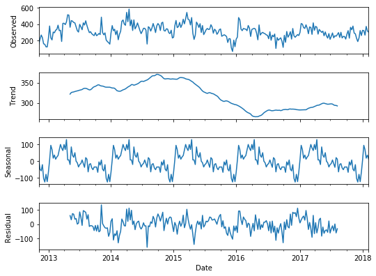


```python
# count defo dropped across 2015 from ~400 to ~300
# residual is fairly noisy, don't think there's anything to say about it.
```


```python
ax = data.groupby('Date').max()['Time'].plot.line(figsize=(8, 6), fontsize=20)
ax = data.groupby('Date').mean()['Time'].plot.line()
ax = data.groupby('Date').min()['Time'].plot.line()
ax.set_xlabel("Date", fontsize=20)
ax.set_ylabel("Finish Time (minute)", fontsize=20)
ax.grid('on', which='major', axis='x')
ax.grid('on', which='major', axis='y')
ax.legend(['Max','Mean','Min'], fontsize=18)
```


    <matplotlib.legend.Legend at 0x22c3668>


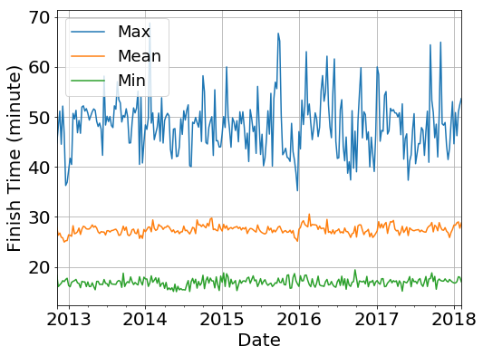


```python
ax = data.groupby('Date').mean()['Time'].plot.line(figsize=(8, 6), fontsize=20)
ax = data.groupby('Date').min()['Time'].plot.line()
ax.set_xlabel("Date", fontsize=20)
ax.set_ylabel("Finish Time (minute)", fontsize=20)
ax.grid('on', which='major', axis='x')
ax.grid('on', which='major', axis='y')
ax.legend(['Mean','Min'], fontsize=18)
```


    <matplotlib.legend.Legend at 0x10b48c50>


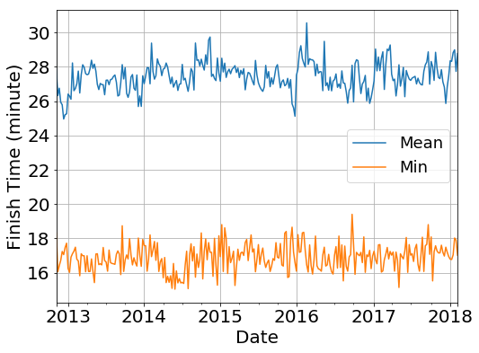


```python
result = seasonal_decompose(data.groupby('Date').mean()['Time'],\
                            model='additive',freq=52)
fig = result.plot()
fig.set_size_inches(8,6)

# not really anything interesting in the Min Mean or Max Times
```


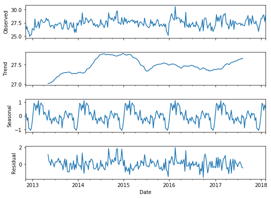


```python
#that the mean time has seasonality makes sense since we see a  positive 
# dependence of mean time with runner count
```


```python
ax = data.groupby('Date').std()['Time'].plot.line(figsize=(8, 6), fontsize=20)


ax.set_xlabel("Date", fontsize=20)
ax.set_ylabel("Std Time (minute)", fontsize=20)
ax.grid('on', which='major', axis='x')
ax.grid('on', which='major', axis='y')
#ax.legend(['Mean','Min'])
```


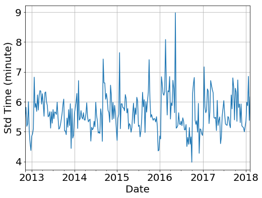


```python

```


```python
df3 = data.dropna(subset=['Age_Grade'])
#df3['Age_Grade'].dropna()
df3['Rounded_Age_Grade'] = df3['Age_Grade'].apply(lambda x: x//2)
df3['Rounded_Age_Grade'] = df3['Rounded_Age_Grade'].apply(lambda x: int(x*2))
```

    C:\ProgramData\Anaconda2\lib\site-packages\ipykernel_launcher.py:3: SettingWithCopyWarning: 
    A value is trying to be set on a copy of a slice from a DataFrame.
    Try using .loc[row_indexer,col_indexer] = value instead
    
    See the caveats in the documentation: http://pandas.pydata.org/pandas-docs/stable/indexing.html#indexing-view-versus-copy
      This is separate from the ipykernel package so we can avoid doing imports until
    C:\ProgramData\Anaconda2\lib\site-packages\ipykernel_launcher.py:4: SettingWithCopyWarning: 
    A value is trying to be set on a copy of a slice from a DataFrame.
    Try using .loc[row_indexer,col_indexer] = value instead
    
    See the caveats in the documentation: http://pandas.pydata.org/pandas-docs/stable/indexing.html#indexing-view-versus-copy
      after removing the cwd from sys.path.
    


```python
df3.head(20)
```


<div>
<style>
    .dataframe thead tr:only-child th {
        text-align: right;
    }

    .dataframe thead th {
        text-align: left;
    }

    .dataframe tbody tr th {
        vertical-align: top;
    }
</style>
<table border="1" class="dataframe">
  <thead>
    <tr style="text-align: right;">
      <th></th>
      <th>Date</th>
      <th>Pos</th>
      <th>Name</th>
      <th>Time</th>
      <th>Age_Cat</th>
      <th>Age_Grade</th>
      <th>Gender</th>
      <th>Gen_Pos</th>
      <th>Club</th>
      <th>Note</th>
      <th>Total_Runs</th>
      <th>Run_No.</th>
      <th>Rounded_Age_Grade</th>
    </tr>
  </thead>
  <tbody>
    <tr>
      <th>0</th>
      <td>2012-11-10</td>
      <td>1</td>
      <td>Michael MCSWIGGAN</td>
      <td>18.316667</td>
      <td>35.0</td>
      <td>73.43</td>
      <td>M</td>
      <td>1.0</td>
      <td>Portmarnock Athletic Club</td>
      <td>First Timer!</td>
      <td>29.0</td>
      <td>1</td>
      <td>72</td>
    </tr>
    <tr>
      <th>1</th>
      <td>2012-11-10</td>
      <td>2</td>
      <td>Alan FOLEY</td>
      <td>18.433333</td>
      <td>30.0</td>
      <td>71.16</td>
      <td>M</td>
      <td>2.0</td>
      <td>Raheny Shamrock AC</td>
      <td>First Timer!</td>
      <td>99.0</td>
      <td>1</td>
      <td>70</td>
    </tr>
    <tr>
      <th>2</th>
      <td>2012-11-10</td>
      <td>3</td>
      <td>Matt SHIELDS</td>
      <td>18.533333</td>
      <td>55.0</td>
      <td>85.07</td>
      <td>M</td>
      <td>3.0</td>
      <td>North Belfast Harriers</td>
      <td>First Timer!</td>
      <td>274.0</td>
      <td>1</td>
      <td>84</td>
    </tr>
    <tr>
      <th>3</th>
      <td>2012-11-10</td>
      <td>4</td>
      <td>David GARGAN</td>
      <td>18.650000</td>
      <td>40.0</td>
      <td>73.73</td>
      <td>M</td>
      <td>4.0</td>
      <td>Raheny Shamrock AC</td>
      <td>First Timer!</td>
      <td>107.0</td>
      <td>1</td>
      <td>72</td>
    </tr>
    <tr>
      <th>4</th>
      <td>2012-11-10</td>
      <td>5</td>
      <td>Paul SINTON-HEWITT</td>
      <td>18.900000</td>
      <td>50.0</td>
      <td>79.28</td>
      <td>M</td>
      <td>5.0</td>
      <td>Ranelagh Harriers</td>
      <td>First Timer!</td>
      <td>369.0</td>
      <td>1</td>
      <td>78</td>
    </tr>
    <tr>
      <th>5</th>
      <td>2012-11-10</td>
      <td>6</td>
      <td>John Gerard MURPHY</td>
      <td>20.250000</td>
      <td>40.0</td>
      <td>68.97</td>
      <td>M</td>
      <td>6.0</td>
      <td>North Belfast Harriers</td>
      <td>First Timer!</td>
      <td>342.0</td>
      <td>1</td>
      <td>68</td>
    </tr>
    <tr>
      <th>6</th>
      <td>2012-11-10</td>
      <td>7</td>
      <td>Conor FITZPATRICK</td>
      <td>20.283333</td>
      <td>20.0</td>
      <td>64.26</td>
      <td>M</td>
      <td>7.0</td>
      <td>Portmarnock Athletic Club</td>
      <td>First Timer!</td>
      <td>40.0</td>
      <td>1</td>
      <td>64</td>
    </tr>
    <tr>
      <th>7</th>
      <td>2012-11-10</td>
      <td>8</td>
      <td>Rachael BECK</td>
      <td>20.450000</td>
      <td>40.0</td>
      <td>76.37</td>
      <td>F</td>
      <td>1.0</td>
      <td>Fingal Triathlon Club</td>
      <td>First Timer!</td>
      <td>9.0</td>
      <td>1</td>
      <td>76</td>
    </tr>
    <tr>
      <th>8</th>
      <td>2012-11-10</td>
      <td>9</td>
      <td>Des HUSIN</td>
      <td>20.533333</td>
      <td>45.0</td>
      <td>69.07</td>
      <td>M</td>
      <td>8.0</td>
      <td>NaN</td>
      <td>First Timer!</td>
      <td>296.0</td>
      <td>1</td>
      <td>68</td>
    </tr>
    <tr>
      <th>9</th>
      <td>2012-11-10</td>
      <td>10</td>
      <td>John COLEMAN</td>
      <td>20.816667</td>
      <td>30.0</td>
      <td>63.01</td>
      <td>M</td>
      <td>9.0</td>
      <td>NaN</td>
      <td>First Timer!</td>
      <td>87.0</td>
      <td>1</td>
      <td>62</td>
    </tr>
    <tr>
      <th>10</th>
      <td>2012-11-10</td>
      <td>11</td>
      <td>Sean MCGOLDRICK</td>
      <td>20.983333</td>
      <td>50.0</td>
      <td>71.41</td>
      <td>M</td>
      <td>10.0</td>
      <td>Raheny Shamrock AC</td>
      <td>First Timer!</td>
      <td>106.0</td>
      <td>1</td>
      <td>70</td>
    </tr>
    <tr>
      <th>11</th>
      <td>2012-11-10</td>
      <td>12</td>
      <td>David O HARA</td>
      <td>21.033333</td>
      <td>45.0</td>
      <td>67.43</td>
      <td>M</td>
      <td>11.0</td>
      <td>Raheny Shamrock AC</td>
      <td>First Timer!</td>
      <td>61.0</td>
      <td>1</td>
      <td>66</td>
    </tr>
    <tr>
      <th>13</th>
      <td>2012-11-10</td>
      <td>14</td>
      <td>Philip WALLNUTT</td>
      <td>21.450000</td>
      <td>45.0</td>
      <td>67.13</td>
      <td>M</td>
      <td>13.0</td>
      <td>NaN</td>
      <td>First Timer!</td>
      <td>120.0</td>
      <td>1</td>
      <td>66</td>
    </tr>
    <tr>
      <th>14</th>
      <td>2012-11-10</td>
      <td>15</td>
      <td>Gerard TYRRELL</td>
      <td>21.583333</td>
      <td>35.0</td>
      <td>61.47</td>
      <td>M</td>
      <td>14.0</td>
      <td>Fingal Triathlon Club</td>
      <td>First Timer!</td>
      <td>30.0</td>
      <td>1</td>
      <td>60</td>
    </tr>
    <tr>
      <th>15</th>
      <td>2012-11-10</td>
      <td>16</td>
      <td>Seamus RUDDY</td>
      <td>21.616667</td>
      <td>30.0</td>
      <td>60.68</td>
      <td>M</td>
      <td>15.0</td>
      <td>NaN</td>
      <td>First Timer!</td>
      <td>11.0</td>
      <td>1</td>
      <td>60</td>
    </tr>
    <tr>
      <th>16</th>
      <td>2012-11-10</td>
      <td>17</td>
      <td>Gavin KEATING</td>
      <td>21.066667</td>
      <td>35.0</td>
      <td>61.62</td>
      <td>M</td>
      <td>16.0</td>
      <td>Portmarnock Athletic Club</td>
      <td>First Timer!</td>
      <td>10.0</td>
      <td>1</td>
      <td>60</td>
    </tr>
    <tr>
      <th>17</th>
      <td>2012-11-10</td>
      <td>18</td>
      <td>Keith FOGARTY</td>
      <td>21.700000</td>
      <td>35.0</td>
      <td>61.14</td>
      <td>M</td>
      <td>17.0</td>
      <td>NaN</td>
      <td>First Timer!</td>
      <td>1.0</td>
      <td>1</td>
      <td>60</td>
    </tr>
    <tr>
      <th>18</th>
      <td>2012-11-10</td>
      <td>19</td>
      <td>Karl CHATTERTON</td>
      <td>21.750000</td>
      <td>30.0</td>
      <td>59.46</td>
      <td>M</td>
      <td>18.0</td>
      <td>Sportsworld</td>
      <td>First Timer!</td>
      <td>120.0</td>
      <td>1</td>
      <td>58</td>
    </tr>
    <tr>
      <th>20</th>
      <td>2012-11-10</td>
      <td>21</td>
      <td>Jim CLINTON</td>
      <td>21.983333</td>
      <td>50.0</td>
      <td>67.63</td>
      <td>M</td>
      <td>20.0</td>
      <td>North Belfast Harriers</td>
      <td>First Timer!</td>
      <td>356.0</td>
      <td>1</td>
      <td>66</td>
    </tr>
    <tr>
      <th>21</th>
      <td>2012-11-10</td>
      <td>22</td>
      <td>Michael FALLON</td>
      <td>22.033333</td>
      <td>50.0</td>
      <td>66.94</td>
      <td>M</td>
      <td>21.0</td>
      <td>NaN</td>
      <td>First Timer!</td>
      <td>1.0</td>
      <td>1</td>
      <td>66</td>
    </tr>
  </tbody>
</table>
</div>


```python

```


```python
ax = df3.groupby('Rounded_Age_Grade').max()['Time'].plot.line(figsize=(8, 6), fontsize=20, marker='o')
ax = df3.groupby('Rounded_Age_Grade').mean()['Time'].plot.line(marker='o')
ax = df3.groupby('Rounded_Age_Grade').min()['Time'].plot.line(marker='o')


ax.set_xlabel("Rounded Age Grade", fontsize=20)
ax.set_ylabel("Finish Time (minute)", fontsize=20)
ax.grid('on', which='major', axis='x')
ax.grid('on', which='major', axis='y')
ax.legend(['Max','Mean','Min'], fontsize=18)
```


    <matplotlib.legend.Legend at 0x10b68da0>


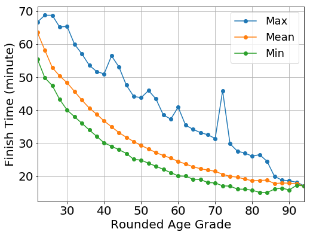


```python
# maybe talk about why max time is jumpy
# the people running max times are necessarily outliers and all you need is
# one terrible person, maybe they were running with someone else
#explain what age grade is 
```


```python
ax = df3.groupby('Rounded_Age_Grade').std()['Time'].plot.line(marker = 'o', figsize=(8, 6), fontsize=20)
ax.set_xlabel("Rounded Age Grade", fontsize=20)
ax.set_ylabel("Std Time (minute)", fontsize=20)
ax.grid('on', which='major', axis='x')
ax.grid('on', which='major', axis='y')
```


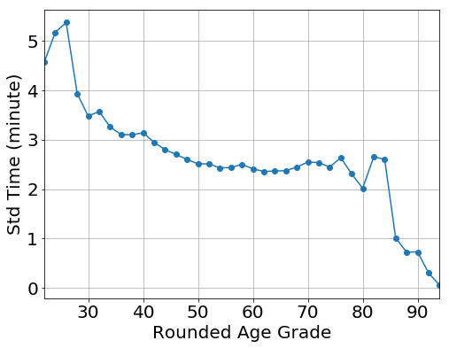


```python
ax = data.groupby('Age_Cat').max()['Time'].plot.line(marker='o', figsize=(8, 6), fontsize=20)
ax = data.groupby('Age_Cat').mean()['Time'].plot.line(marker='o', figsize=(8, 6), fontsize=20)
ax = data.groupby('Age_Cat').min()['Time'].plot.line(marker='o', figsize=(8, 6), fontsize=20)
ax.legend(['Max','Mean','Min'], fontsize=18)
ax.set_xlabel("Age Category", fontsize=20)
ax.set_ylabel("Finish Time (minute)", fontsize=20)
ax.grid('on', which='major', axis='x')
ax.grid('on', which='major', axis='y')
```


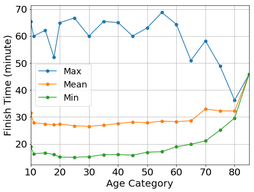


```python
ax = data.groupby('Age_Cat').std()['Time'].plot.line(marker='o', figsize=(8, 6), fontsize=20)
ax.set_xlabel("Age Category", fontsize=20)
ax.set_ylabel("Std of Time (minute)", fontsize=20)
ax.grid('on', which='major', axis='x')
ax.grid('on', which='major', axis='y')
```


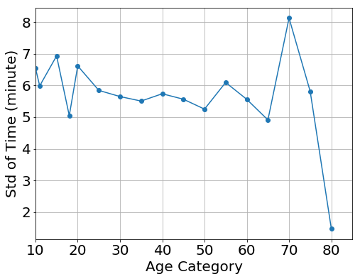


```python
x = data.groupby('Date').count()['Pos']
ymax = data.groupby('Date').max()['Time']
ymean = data.groupby('Date').mean()['Time']
ymin = data.groupby('Date').min()['Time']
```


```python

```


```python
plt.figure(figsize=(8,6))
plt.scatter(x,ymax, label='Max')
plt.scatter(x,ymean, label='Mean')
plt.scatter(x,ymin, label='Min')
#plt.title('sometitle')
plt.xlabel('Runner Count', fontsize=18)
plt.ylabel('Finish Time', fontsize=18)
plt.xticks(fontsize=18)
plt.yticks(fontsize=18)
plt.legend(fontsize=18)
plt.show()
```


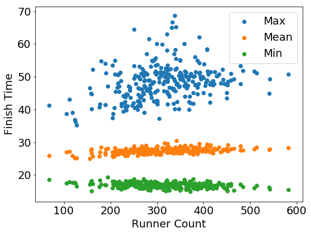


```python
plt.figure(figsize=(8,6))
plt.scatter(x,ymean, label='Mean')
plt.scatter(x,ymin, label='Min')
plt.xlabel('Runner Count', fontsize=18)
plt.ylabel('Finish Time', fontsize=18)
plt.xticks(fontsize=18)
plt.yticks(fontsize=18)
plt.legend(fontsize=18)
plt.show()
```


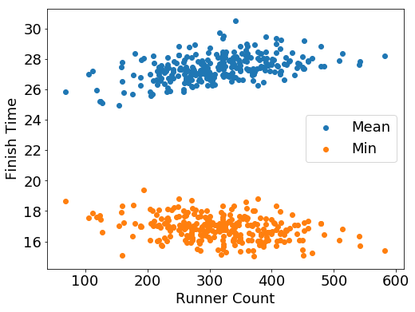


```python
# talk about the trend
```


```python
ystd = data.groupby('Date').std()['Time']
plt.figure(figsize=(8,6))
plt.scatter(x,ystd)
#plt.title('sometitle')
plt.xlabel('Runner Count', fontsize=18)
plt.ylabel('Std Time', fontsize=18)
plt.xticks(fontsize=18)
plt.yticks(fontsize=18)
plt.show()
```


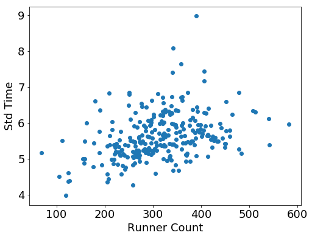


```python

```


```python
dft = data.groupby(['Date','Gender']).count()['Pos']
dft = dft.unstack()
dft['Ratio'] = dft['M']/dft['F']
dft['Date'] = dft.index
dft.head()
```


<div>
<style>
    .dataframe thead tr:only-child th {
        text-align: right;
    }

    .dataframe thead th {
        text-align: left;
    }

    .dataframe tbody tr th {
        vertical-align: top;
    }
</style>
<table border="1" class="dataframe">
  <thead>
    <tr style="text-align: right;">
      <th>Gender</th>
      <th>F</th>
      <th>M</th>
      <th>Ratio</th>
      <th>Date</th>
    </tr>
    <tr>
      <th>Date</th>
      <th></th>
      <th></th>
      <th></th>
      <th></th>
    </tr>
  </thead>
  <tbody>
    <tr>
      <th>2012-11-10</th>
      <td>81</td>
      <td>69</td>
      <td>0.851852</td>
      <td>2012-11-10</td>
    </tr>
    <tr>
      <th>2012-11-17</th>
      <td>85</td>
      <td>117</td>
      <td>1.376471</td>
      <td>2012-11-17</td>
    </tr>
    <tr>
      <th>2012-11-24</th>
      <td>122</td>
      <td>131</td>
      <td>1.073770</td>
      <td>2012-11-24</td>
    </tr>
    <tr>
      <th>2012-12-01</th>
      <td>90</td>
      <td>132</td>
      <td>1.466667</td>
      <td>2012-12-01</td>
    </tr>
    <tr>
      <th>2012-12-08</th>
      <td>57</td>
      <td>92</td>
      <td>1.614035</td>
      <td>2012-12-08</td>
    </tr>
  </tbody>
</table>
</div>


```python
ax = dft.plot(x='Date',y='Ratio', figsize=(8, 6), fontsize=20)
ax.set_xlabel("Date", fontsize=20)
ax.set_ylabel("Ratio", fontsize=20)
ax.grid('on', which='major', axis='x')
ax.grid('on', which='major', axis='y')
ax.legend(['Ratio'], fontsize=18)
```


    <matplotlib.legend.Legend at 0x1207ff28>


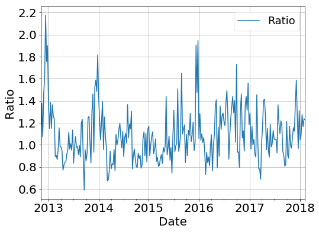


```python
series = dft['Ratio']
result = seasonal_decompose(series,\
                            model='additive',freq=52)
fig = result.plot()
fig.set_size_inches(8,6)
```


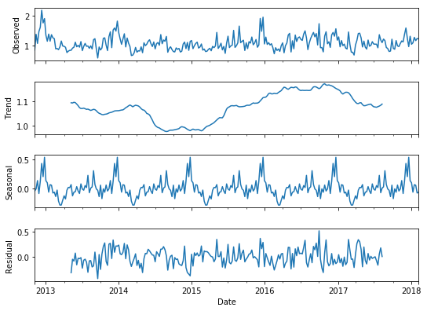


```python
## peak comes just before new year, cf count peak is just after NYE.
```


```python
# the seasonality is kind of expected when we consider the weather data.
# the ratio of men to women goes up the colder and rainier it is
```


```python
dft = data.groupby(['Age_Cat','Gender']).count()['Pos']
dft = dft.unstack()
dft['Ratio'] = dft['M']/dft['F']
dft['Age_Cat'] = dft.index
dft.head()
```


<div>
<style>
    .dataframe thead tr:only-child th {
        text-align: right;
    }

    .dataframe thead th {
        text-align: left;
    }

    .dataframe tbody tr th {
        vertical-align: top;
    }
</style>
<table border="1" class="dataframe">
  <thead>
    <tr style="text-align: right;">
      <th>Gender</th>
      <th>F</th>
      <th>M</th>
      <th>Ratio</th>
      <th>Age_Cat</th>
    </tr>
    <tr>
      <th>Age_Cat</th>
      <th></th>
      <th></th>
      <th></th>
      <th></th>
    </tr>
  </thead>
  <tbody>
    <tr>
      <th>10.0</th>
      <td>468.0</td>
      <td>614.0</td>
      <td>1.311966</td>
      <td>10.0</td>
    </tr>
    <tr>
      <th>11.0</th>
      <td>1069.0</td>
      <td>1599.0</td>
      <td>1.495790</td>
      <td>11.0</td>
    </tr>
    <tr>
      <th>15.0</th>
      <td>900.0</td>
      <td>996.0</td>
      <td>1.106667</td>
      <td>15.0</td>
    </tr>
    <tr>
      <th>18.0</th>
      <td>352.0</td>
      <td>229.0</td>
      <td>0.650568</td>
      <td>18.0</td>
    </tr>
    <tr>
      <th>20.0</th>
      <td>1006.0</td>
      <td>635.0</td>
      <td>0.631213</td>
      <td>20.0</td>
    </tr>
  </tbody>
</table>
</div>


```python
ax = dft.plot(x='Age_Cat',y='Ratio', figsize=(8, 6), fontsize=20, marker='o')

ax.set_xlabel("Age_Cat", fontsize=20)
ax.set_ylabel("Ratio", fontsize=20)
ax.grid('on', which='major', axis='x')
ax.grid('on', which='major', axis='y')
ax.legend(['Ratio'], fontsize=18)
```


    <matplotlib.legend.Legend at 0x1084c3c8>


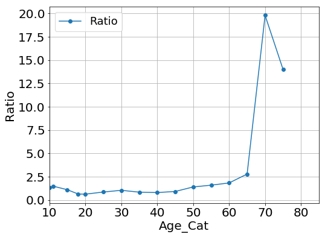


```python
ax = dft.plot(x='Age_Cat',y='Ratio', figsize=(8, 6), fontsize=20, marker='o')

ax.set_xlabel("Age_Cat", fontsize=20)
ax.set_ylabel("Ratio", fontsize=20)
ax.grid('on', which='major', axis='x')
ax.grid('on', which='major', axis='y')
ax.legend(['Ratio'], fontsize=18)
ax.set_xlim(xmax=65)
ax.set_ylim(ymax=5)
```


    (-0.32722664015904579, 5)


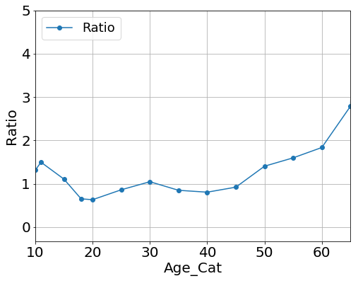


```python
# that dip coincides with the dip/bump in mean times of male and females
```


```python
dft = df3.groupby(['Rounded_Age_Grade','Gender']).count()['Pos']
dft = dft.unstack()
dft['Ratio'] = dft['M']/dft['F']
dft['Rounded_Age_Grade'] = dft.index
dft.head()
```


<div>
<style>
    .dataframe thead tr:only-child th {
        text-align: right;
    }

    .dataframe thead th {
        text-align: left;
    }

    .dataframe tbody tr th {
        vertical-align: top;
    }
</style>
<table border="1" class="dataframe">
  <thead>
    <tr style="text-align: right;">
      <th>Gender</th>
      <th>F</th>
      <th>M</th>
      <th>Ratio</th>
      <th>Rounded_Age_Grade</th>
    </tr>
    <tr>
      <th>Rounded_Age_Grade</th>
      <th></th>
      <th></th>
      <th></th>
      <th></th>
    </tr>
  </thead>
  <tbody>
    <tr>
      <th>22</th>
      <td>4.0</td>
      <td>1.0</td>
      <td>0.250000</td>
      <td>22</td>
    </tr>
    <tr>
      <th>24</th>
      <td>17.0</td>
      <td>16.0</td>
      <td>0.941176</td>
      <td>24</td>
    </tr>
    <tr>
      <th>26</th>
      <td>15.0</td>
      <td>23.0</td>
      <td>1.533333</td>
      <td>26</td>
    </tr>
    <tr>
      <th>28</th>
      <td>57.0</td>
      <td>29.0</td>
      <td>0.508772</td>
      <td>28</td>
    </tr>
    <tr>
      <th>30</th>
      <td>125.0</td>
      <td>48.0</td>
      <td>0.384000</td>
      <td>30</td>
    </tr>
  </tbody>
</table>
</div>


```python
ax = dft.plot(x='Rounded_Age_Grade',y='Ratio', figsize=(8, 6), fontsize=20, marker='o')

ax.set_xlabel("Rounded_Age_Grade", fontsize=20)
ax.set_ylabel("Ratio", fontsize=20)
ax.grid('on', which='major', axis='x')
ax.grid('on', which='major', axis='y')
ax.legend(['Ratio'], fontsize=18)
```


    <matplotlib.legend.Legend at 0xcbe4d68>


    C:\ProgramData\Anaconda2\lib\site-packages\matplotlib\transforms.py:661: RuntimeWarning: invalid value encountered in absolute
      inside = ((abs(dx0 + dx1) + abs(dy0 + dy1)) == 0)
    


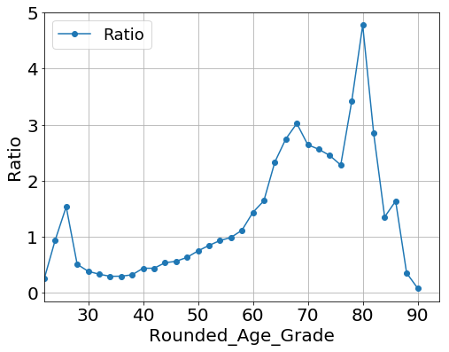


```python
## so the men who come along tend to be good and hardcore runners
# this jibes well with the weather data and other data findings
# like the runner count and the seasonality
```


```python
dft = data.groupby(['Date','Gender']).count()['Pos']
dft = dft.unstack()
dft['Ratio'] = dft['M']/dft['F']
dft['Count'] = dft['M']+dft['F']
dft.head()
```


<div>
<style>
    .dataframe thead tr:only-child th {
        text-align: right;
    }

    .dataframe thead th {
        text-align: left;
    }

    .dataframe tbody tr th {
        vertical-align: top;
    }
</style>
<table border="1" class="dataframe">
  <thead>
    <tr style="text-align: right;">
      <th>Gender</th>
      <th>F</th>
      <th>M</th>
      <th>Ratio</th>
      <th>Count</th>
    </tr>
    <tr>
      <th>Date</th>
      <th></th>
      <th></th>
      <th></th>
      <th></th>
    </tr>
  </thead>
  <tbody>
    <tr>
      <th>2012-11-10</th>
      <td>81</td>
      <td>69</td>
      <td>0.851852</td>
      <td>150</td>
    </tr>
    <tr>
      <th>2012-11-17</th>
      <td>85</td>
      <td>117</td>
      <td>1.376471</td>
      <td>202</td>
    </tr>
    <tr>
      <th>2012-11-24</th>
      <td>122</td>
      <td>131</td>
      <td>1.073770</td>
      <td>253</td>
    </tr>
    <tr>
      <th>2012-12-01</th>
      <td>90</td>
      <td>132</td>
      <td>1.466667</td>
      <td>222</td>
    </tr>
    <tr>
      <th>2012-12-08</th>
      <td>57</td>
      <td>92</td>
      <td>1.614035</td>
      <td>149</td>
    </tr>
  </tbody>
</table>
</div>


```python
ax = dft.plot.scatter(x='Count',y='Ratio', figsize=(8, 6), fontsize=20,)
ax.set_xlabel("Count", fontsize=20)
ax.set_ylabel("Ratio M/F", fontsize=20)
ax.grid('on', which='major', axis='x')
ax.grid('on', which='major', axis='y')
ax.grid('on', which='minor', axis='x')
ax.grid('on', which='minor', axis='y')
ax.set_xscale('log')
```


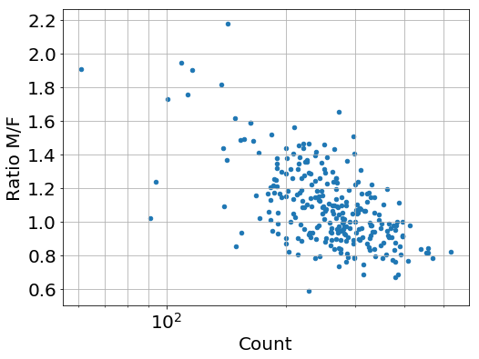


```python
## and the fact that when few people come out the ratio of men to women goes up.
## and we already know the count is seasonal so since count and the ratio are 
## correlated we expect some seasonality in the ratio.
```


```python

```


```python

```


```python

```


```python

```


```python

```


```python

```


```python

```


```python

```


```python

```


```python

```


```python

```


```python

```


```python

```


```python

```


```python

```


```python

```


```python

```


```python

```


```python

```
